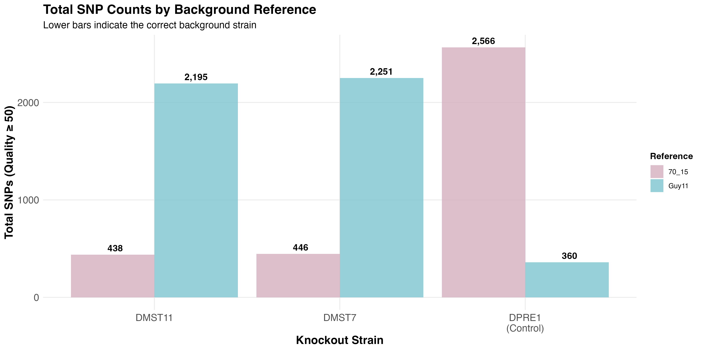
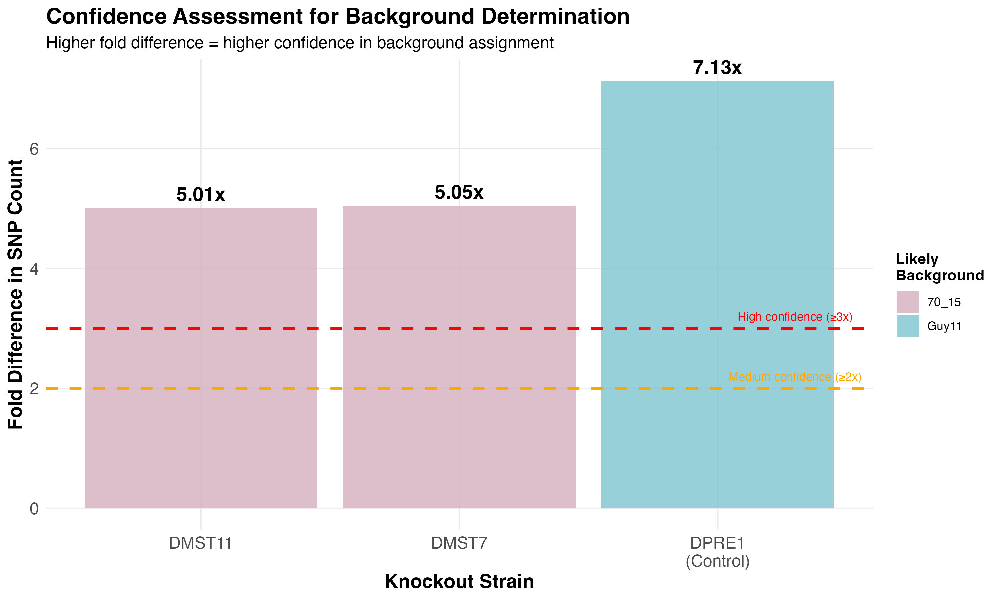

WGS - Background Strain Check Using Variant Calling
================
Neha Sahu
16 February, 2026

- [Background Strain Check Workflow Using Whole Genome
  Sequencing](#background-strain-check-workflow-using-whole-genome-sequencing)
  - [Overview](#overview)
    - [Rationale](#rationale)
  - [Prerequisites](#prerequisites)
    - [Examples used](#examples-used)
  - [Workflow Steps](#workflow-steps)
    - [Step 1: Reference
      Genome(s)](#step-1-reference-genome-preparation)
    - [Step 2: Variant Calling with
      BCFtools](#step-2-variant-calling-with-bcftools)
    - [Step 3: Variant Statistics
      Generation](#step-3-variant-statistics-generation)
  - [Step 4: Data Analysis and
    Visualization](#step-4-data-analysis-and-interpretation)
    - [Understanding BCFtools Stats
      Output](#understanding-bcftools-stats-output)
    - [Expected Results Pattern](#expected-results-pattern)
    - [Load Packages](#load-packages)
    - [Import Example Data](#import-example-data)
    - [Data Processing and Quality
      Filtering](#data-processing-and-quality-filtering)
    - [Calculate Total SNPs per Strain-Background
      Combination](#calculate-total-snps-per-strain-background-combination)
    - [Results](#results)
    - [Total SNPs Comparison Bar Plot](#total-snps-comparison-bar-plot)
  - [Contact and Support](#contact-and-support)

# Background Strain Check Workflow Using Whole Genome Sequencing

## Overview

This workflow describes the process for determining the background
strain of gene knockout (KO) mutants in *Magnaporthe oryzae* using whole
genome sequencing (WGS) data and variant calling. The approach relies on
the principle that **the correct background strain will show fewer SNPs
or variants when compared to the knockout strain**.

### Rationale

When creating gene knockouts, the transformation is typically performed
in a specific background strain. Over time, the identity of this
background strain may become uncertain. By comparing the knockout
strain’s genome against candidate reference genomes, we can identify the
true background based on genetic similarity.

The main idea is that the knockout strain will have the fewest variants
(SNPs/indels) when aligned to its correct background reference genome.

## Prerequisites

- **Access to HPC** - Norwich Biosciences Institute/The Sainsbury
  Laboratory HPC system
- **Raw WGS sequencing data** (paired-end FASTQ files) for knockout
  strains
- **Multiple reference genomes** - candidate background strains (e.g.,
  Guy11, 70_15 for *Magnaporthe oryzae*)
- **Positive control strain** - strain with known background (e.g.,
  DPRE1 with Guy11 background)
- **Processed BAM and BAI files** - sorted BAM and BAI files from
  previous alignment workflow (eg. can be obtained by running
  `scripts/01_fastq_to_bam_bai.sh` for paired end reads)
- **BCFtools and SAMtools** - for variant calling and indexing

### Examples used

**Knockout strains being tested:** **DMST11** and **DMST7** (unknown
background)

**Reference genomes tested:** - **Guy11** and **70_15**

**Positive control:** - **DPRE1** (known Guy11 background)

## Workflow Steps

### Step 1: Reference Genome(s)

Before variant calling, all reference genomes should be indexed:

``` bash
# Index all reference genome FASTA files
samtools faidx guy11.fasta
samtools faidx 70_15.fasta
# Add additional reference genomes if needed
```

### Step 2: Variant Calling with BCFtools

Run the variant calling script using `sbatch 04variant_calling.sh`

#### Script Configuration

``` bash
#!/bin/bash
#SBATCH -p tsl-medium
#SBATCH --mem=100G
#SBATCH -J bam2vcf
#SBATCH --mail-type=begin,end,fail
#SBATCH --mail-user=neha.sahu@tsl.ac.uk
#SBATCH -o slurm.%j.out
#SBATCH -e slurm.%j.err

source package /tsl/software/testing/bin/bcftools-1.9
source package /tsl/software/testing/bin/samtools-1.9

# Index reference genomes
samtools faidx 70_15.fasta
samtools faidx guy11.fasta

# Variant calling against multiple references
# 70_15 reference
bcftools mpileup -Ou -f 70_15.fasta dmst11_70_15_sorted.bam | bcftools call -mv -Ob -o dmst11_70_15variants.bcf
bcftools mpileup -Ou -f 70_15.fasta dpre1_70_15_sorted.bam | bcftools call -mv -Ob -o dpre1_70_15variants.bcf
bcftools mpileup -Ou -f 70_15.fasta dmst7_70_15_sorted.bam | bcftools call -mv -Ob -o dmst7_70_15variants.bcf

# Guy11 reference  
bcftools mpileup -Ou -f guy11.fasta dmst11_guy11_sorted.bam | bcftools call -mv -Ob -o dmst11_guy11variants.bcf
bcftools mpileup -Ou -f guy11.fasta dpre1_guy11_sorted.bam | bcftools call -mv -Ob -o dpre1_guy11variants.bcf
bcftools mpileup -Ou -f guy11.fasta dmst7_guy11_sorted.bam | bcftools call -mv -Ob -o dmst7_guy11variants.bcf
```

#### Understanding the Variant Calling Command and Output.

``` bash
bcftools mpileup -Ou -f reference.fasta sample.bam | bcftools call -mv -Ob -o output.bcf
```

**BCFtools mpileup options:**

\- `-O u`: Output uncompressed BCF format

\- `-f reference.fasta`: Reference genome file

**BCFtools call options:**

\- `-m`: Use multiallelic caller (alternative alleles)

\- `-v`: Output variant sites only (skip reference-only sites)

\- `-O b`: Output compressed BCF format

\- `-o output.bcf`: Output file name

The output file has a lot of important information such as summaries of
number of SNPs, transitions, transversions, indels (insertion +
deletions), distribution if indels, depth distribution etc. Here, I will
be using the Stats by quality which can be extracted by the string
`"QUAL"` - which shows SNP counts by quality score. For more details
read: <https://samtools.github.io/bcftools/bcftools.html>

### Step 3: Variant Statistics Generation

Run the statistics generation script using `sbatch 05bcf_stats.sh` to
extract the QUAL results

#### Script Configuration

``` bash
#!/bin/bash
#SBATCH -p tsl-medium
#SBATCH --mem=100G
#SBATCH -J vcf2stats
#SBATCH --mail-type=begin,end,fail
#SBATCH --mail-user=neha.sahu@tsl.ac.uk
#SBATCH -o slurm.%j.out
#SBATCH -e slurm.%j.err

source package /tsl/software/testing/bin/bcftools-1.9

# Generate statistics from BCF files
# 70_15 reference
bcftools stats dmst11_70_15variants.bcf > dmst11_70_15variants.txt
bcftools stats dpre1_70_15variants.bcf > dpre1_70_15variants.txt
bcftools stats dmst7_70_15variants.bcf > dmst7_70_15variants.txt

# guy11 reference
bcftools stats dmst11_guy11variants.bcf > dmst11_guy11variants.txt
bcftools stats dpre1_guy11variants.bcf > dpre1_guy11variants.txt
bcftools stats dmst7_guy11variants.bcf > dmst7_guy11variants.txt

# Compile all statistics into a single TSV file
(echo -e "# QUAL\t[2]id\t[3]Quality\t[4]number of SNPs\t[5]number of transitions (1st ALT)\t[6]number of transversions (1st ALT)\t[7]number of indels\tBackground\tKO"; \
grep -H "^QUAL" *variants.txt | \
awk -F: '{split($1,a,"_"); bg=(a[2]=="guy11"?"guy11":"x"a[2]"_"a[3]); gsub(/variants.txt/,"",bg); print $2"\t"bg"\t"tolower(a[1])}') > SNPs.tsv
```

------------------------------------------------------------------------

## Step 4: Data Analysis and Visualization

### Understanding BCFtools Stats Output

Each `*variants.txt` file contains multiple sections. The key section

    # QUAL, Quality bins, number of SNPs, number of transitions, number of transversions, number of indels
    QUAL    0   30  1500    800 700 50
    QUAL    1   40  800 450 350 25
    QUAL    2   50  400 220 180 15

### Expected Results Pattern

**For DPRE1 (positive control - known Guy11 background):**

    DPRE1 vs Guy11:     Low SNP count   (correct background)
    DPRE1 vs 70_15:     High SNP count  (wrong background)

**For unknown knockout strains (DMST11, DMST7):**

    DMST11 vs Guy11:    ? SNP count  
    DMST11 vs 70_15:    ? SNP count    ← Compare to determine background

    DMST7 vs Guy11:     ? SNP count
    DMST7 vs 70_15:     ? SNP count     ← Compare to determine background

### Load Packages

``` r
library(tidyverse)
library(here)
```

### Import Example Data

``` r
# Import compiled SNP data
snps <- read_tsv(here("data/SNPs.tsv"), show_col_types = FALSE)

# Display first few rows
head(snps, 10)
```

    ## # A tibble: 10 × 9
    ##    `# QUAL` `[2]id` `[3]Quality` `[4]number of SNPs` [5]number of transitions …¹
    ##    <chr>      <dbl>        <dbl>               <dbl>                       <dbl>
    ##  1 QUAL           0            3                  33                          13
    ##  2 QUAL           0            4                  19                           6
    ##  3 QUAL           0            5                  36                          18
    ##  4 QUAL           0            6                  20                          13
    ##  5 QUAL           0            7                  20                          10
    ##  6 QUAL           0            8                  20                           8
    ##  7 QUAL           0            9                  19                           4
    ##  8 QUAL           0           10                  22                           7
    ##  9 QUAL           0           11                  11                           5
    ## 10 QUAL           0           12                  14                           3
    ## # ℹ abbreviated name: ¹​`[5]number of transitions (1st ALT)`
    ## # ℹ 4 more variables: `[6]number of transversions (1st ALT)` <dbl>,
    ## #   `[7]number of indels` <dbl>, Background <chr>, KO <chr>

``` r
# Summary of data
summary(snps)
```

    ##     # QUAL              [2]id     [3]Quality    [4]number of SNPs 
    ##  Length:1288        Min.   :0   Min.   :  3.0   Min.   :   0.000  
    ##  Class :character   1st Qu.:0   1st Qu.: 56.0   1st Qu.:   1.000  
    ##  Mode  :character   Median :0   Median :111.0   Median :   3.000  
    ##                     Mean   :0   Mean   :112.5   Mean   :   9.752  
    ##                     3rd Qu.:0   3rd Qu.:168.0   3rd Qu.:   7.000  
    ##                     Max.   :0   Max.   :228.0   Max.   :1326.000  
    ##  [5]number of transitions (1st ALT) [6]number of transversions (1st ALT)
    ##  Min.   :  0.000                    Min.   :  0.000                     
    ##  1st Qu.:  1.000                    1st Qu.:  0.000                     
    ##  Median :  2.000                    Median :  1.000                     
    ##  Mean   :  6.166                    Mean   :  3.585                     
    ##  3rd Qu.:  4.000                    3rd Qu.:  2.000                     
    ##  Max.   :909.000                    Max.   :417.000                     
    ##  [7]number of indels  Background             KO           
    ##  Min.   :  0.000     Length:1288        Length:1288       
    ##  1st Qu.:  1.000     Class :character   Class :character  
    ##  Median :  5.000     Mode  :character   Mode  :character  
    ##  Mean   :  9.463                                          
    ##  3rd Qu.: 10.000                                          
    ##  Max.   :952.000

### Data Processing and Quality Filtering

``` r
# Select relevant columns and rename for clarity
snp_fin <- snps %>% 
  select(`[3]Quality`, `[4]number of SNPs`, Background, KO) %>%
  rename(
    quality = `[3]Quality`,
    SNPs = `[4]number of SNPs`
  )

str(snp_fin)
```

    ## tibble [1,288 × 4] (S3: tbl_df/tbl/data.frame)
    ##  $ quality   : num [1:1288] 3 4 5 6 7 8 9 10 11 12 ...
    ##  $ SNPs      : num [1:1288] 33 19 36 20 20 20 19 22 11 14 ...
    ##  $ Background: chr [1:1288] "x70_15" "x70_15" "x70_15" "x70_15" ...
    ##  $ KO        : chr [1:1288] "dmst11" "dmst11" "dmst11" "dmst11" ...

``` r
# Apply quality filtering - remove low quality variants
snp_filt <- snp_fin %>%
  filter(quality >= 50 & SNPs > 0) 

cat("\nData after quality filtering (Q>=50, SNPs>0):\n")
```

    ## 
    ## Data after quality filtering (Q>=50, SNPs>0):

``` r
cat("Filtered dataset:", nrow(snp_filt), "rows\n")
```

    ## Filtered dataset: 865 rows

``` r
cat("Quality range:", min(snp_filt$quality), "-", max(snp_filt$quality), "\n")
```

    ## Quality range: 50 - 228

``` r
cat("SNP range:", min(snp_filt$SNPs), "-", max(snp_filt$SNPs), "\n\n")
```

    ## SNP range: 1 - 1326

``` r
# Display filtered data
snp_filt %>% 
  arrange(Background, KO, quality)
```

    ## # A tibble: 865 × 4
    ##    quality  SNPs Background KO    
    ##      <dbl> <dbl> <chr>      <chr> 
    ##  1      50     1 x70_15     dmst11
    ##  2      51     2 x70_15     dmst11
    ##  3      52     4 x70_15     dmst11
    ##  4      53     3 x70_15     dmst11
    ##  5      54     1 x70_15     dmst11
    ##  6      55     3 x70_15     dmst11
    ##  7      56     3 x70_15     dmst11
    ##  8      57     5 x70_15     dmst11
    ##  9      58     2 x70_15     dmst11
    ## 10      59     3 x70_15     dmst11
    ## # ℹ 855 more rows

### Calculate Total SNPs per Strain-Background Combination

``` r
# Calculate total SNPs per strain-background combination
total_snps <- snp_filt %>% 
  group_by(Background, KO) %>% 
  summarise(
    total_snps = sum(SNPs),
    quality_bins = n(),
    avg_quality = round(mean(quality), 1),
    .groups = 'drop'
  ) %>%
  arrange(KO, total_snps)


head(total_snps)
```

    ## # A tibble: 6 × 5
    ##   Background KO     total_snps quality_bins avg_quality
    ##   <chr>      <chr>       <dbl>        <int>       <dbl>
    ## 1 x70_15     dmst11        438          120        129 
    ## 2 xguy11     dmst11       2195          168        136.
    ## 3 x70_15     dmst7         446          135        132.
    ## 4 xguy11     dmst7        2251          168        136.
    ## 5 xguy11     dpre1         360          100        122.
    ## 6 x70_15     dpre1        2566          174        139.

``` r
# Create a wider table for easier comparison
total_snps_wide <- total_snps %>%
  select(Background, KO, total_snps) %>%
  pivot_wider(names_from = Background, values_from = total_snps) %>%
  mutate(
    fold_difference = round(pmax(xguy11, x70_15, na.rm = TRUE) / pmin(xguy11, x70_15, na.rm = TRUE), 2),
    likely_background = case_when(
      xguy11 < x70_15 ~ "Guy11",
      x70_15 < xguy11 ~ "70_15",
      TRUE ~ "Unclear"
    )
  )

head(total_snps_wide)
```

    ## # A tibble: 3 × 5
    ##   KO     x70_15 xguy11 fold_difference likely_background
    ##   <chr>   <dbl>  <dbl>           <dbl> <chr>            
    ## 1 dmst11    438   2195            5.01 70_15            
    ## 2 dmst7     446   2251            5.05 70_15            
    ## 3 dpre1    2566    360            7.13 Guy11

### Results

#### SNP Distribution Scatter Plot

``` r
# Create the main scatter plot for SNP analysis
p1 <- ggplot(snp_filt, aes(x = quality, y = SNPs, color = Background, size = SNPs)) +
  geom_point(alpha = 0.7) +
  scale_size(range = c(1, 15), name = "SNPs") +
  facet_grid(Background ~ KO, 
             labeller = labeller(
               Background = c("xguy11" = "Guy11 Reference", "x70_15" = "70_15 Reference"),
               KO = c("dmst11" = "DMST11", "dmst7" = "DMST7", "dpre1" = "DPRE1 (Control)")
             )) +
  geom_text(data = total_snps, 
            aes(x = Inf, y = Inf, label = paste("Total SNPs:", format(total_snps, big.mark = ","))), 
            hjust = 1.1, vjust = 1.5, size = 5, inherit.aes = FALSE, 
            color = "black", fontface = "bold") +
  labs(
    x = "Quality Score", 
    y = "Number of SNPs", 
    title = "SNP Distribution Analysis for Background Strain Determination",
    subtitle = "Lower SNP counts indicate correct background strain",
    caption = "Quality threshold: ≥50 | Each point represents a quality bin"
  ) +
  scale_color_manual(
    values = c("xguy11" = "#7ec4cf", "x70_15" = "#d4afbf"),
    labels = c("xguy11" = "Guy11", "x70_15" = "70_15"),
    name = "Reference"
  ) +
  theme_minimal() +
  theme(
    axis.text = element_text(size = 12),
    axis.title = element_text(size = 16, face = "bold"),
    strip.text = element_text(size = 14, face = "bold"),
    strip.background = element_rect(color = "white", fill = "white"),
    plot.title = element_text(size = 20, face = "bold"),
    plot.subtitle = element_text(size = 14,),
    plot.caption = element_text(size = 10),
    panel.border = element_rect(fill = NA, linewidth = 1),
    legend.title = element_text(face = "bold"),
    legend.text = element_text()
  )
ggsave(here("analysis/images/background_determination_scatter.png"), p1, width = 16, height = 8, dpi = 300)
```


### Total SNPs Comparison Bar Plot

``` r
# Create bar plot for total SNPs comparison
p2 <- total_snps %>%
  ggplot(aes(x = KO, y = total_snps, fill = Background)) +
  geom_col(position = "dodge", alpha = 0.8) +
  geom_text(aes(label = format(total_snps, big.mark = ",")), 
            position = position_dodge(width = 0.9), 
            vjust = -0.5, size = 4, fontface = "bold") +
  scale_fill_manual(
    values = c("xguy11" = "#7ec4cf", "x70_15" = "#d4afbf"),
    labels = c("xguy11" = "Guy11", "x70_15" = "70_15"),
    name = "Reference"
  ) +
  scale_x_discrete(
    labels = c("dmst11" = "DMST11", "dmst7" = "DMST7", "dpre1" = "DPRE1\n(Control)")
  ) +
  labs(
    x = "Knockout Strain",
    y = "Total SNPs (Quality ≥ 50)",
    title = "Total SNP Counts by Background Reference",
    subtitle = "Lower bars indicate the correct background strain"
  ) +
  theme_minimal() +
  theme(
    axis.text = element_text(size = 12),
    axis.title = element_text(size = 14, face = "bold"),
    plot.title = element_text(size = 16, face = "bold"),
    plot.subtitle = element_text(size = 12),
    legend.title = element_text(face = "bold"),
    panel.grid.minor = element_blank()
  )
ggsave(here("analysis/images/total_snps_comparison.png"), p2, width = 12, height = 6, dpi = 300)
```




#### Fold Difference Analysis

``` r
# Create fold difference plot
p3 <- total_snps_wide %>%
  ggplot(aes(x = KO, y = fold_difference, fill = likely_background)) +
  geom_col(alpha = 0.8) +
  geom_text(aes(label = paste0(fold_difference, "x")), 
            vjust = -0.5, size = 5, fontface = "bold") +
  geom_hline(yintercept = 3, linetype = "dashed", color = "red", linewidth = 1) +
  geom_hline(yintercept = 2, linetype = "dashed", color = "orange", linewidth = 1) +
  scale_fill_manual(
    values = c("Guy11" = "#7ec4cf", "70_15" = "#d4afbf"),
    name = "Likely\nBackground"
  ) +
  scale_x_discrete(
    labels = c("dmst11" = "DMST11", "dmst7" = "DMST7", "dpre1" = "DPRE1\n(Control)")
  ) +
  annotate("text", x = 3.3, y = 3.2, label = "High confidence (≥3x)", 
           size = 3, color = "red") +
  annotate("text", x = 3.3, y = 2.2, label = "Medium confidence (≥2x)", 
           size = 3, color = "orange") +
  labs(
    x = "Knockout Strain",
    y = "Fold Difference in SNP Count",
    title = "Confidence Assessment for Background Determination",
    subtitle = "Higher fold difference = higher confidence in background assignment"
  ) +
  theme_minimal() +
  theme(
    axis.text = element_text(size = 12),
    axis.title = element_text(size = 14, face = "bold"),
    plot.title = element_text(size = 16, face = "bold"),
    plot.subtitle = element_text(size = 12),
    legend.title = element_text(face = "bold"),
    panel.grid.minor = element_blank()
  )

ggsave(here("analysis/images/fold_difference_confidence.png"), p3, width = 10, height = 6, dpi = 300)
```


From this example, the positive control behaves as expected: DPRE1
aligns with the Guy11 background, showing fewer SNPs relative to Guy11
than to 70_15.

Similarly, the test mutants DMST11 and DMST7 are suggested to be with
the 70_15 background, as indicated by their lower SNP counts compared to
70_15 rather than Guy11.

## Contact and Support

For questions about this workflow or issues contact:
<neha.sahu.tsl@gmail.com>

------------------------------------------------------------------------

*This workflow was developed for mutant background strain confirmation
from whole genome sequencing in Magnaporthe oryzae research projects.*
