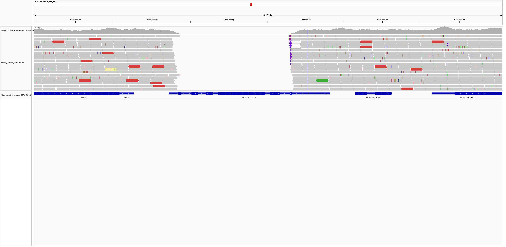

WGS - Gene Knockout Confirmation
================
Neha Sahu
03 February, 2026

- [Gene Knockout Confirmation Workflow Using Whole Genome
  Sequencing](#gene-knockout-confirmation-workflow-using-whole-genome-sequencing)
  - [Overview](#overview)
  - [Prerequisites](#prerequisites)
- [Workflow Steps](#workflow-steps)
  - [Step 1: Data Upload and Initial
    Processing](#step-1-data-upload-and-initial-processing)
  - [Step 2: FASTQ to BAM Conversion](#step-2-fastq-to-bam-conversion)
    - [Script Configuration](#script-configuration)
    - [What the Script Does](#what-the-script-does)
    - [Expected Output Files](#expected-output-files)
  - [Step 3: IGV Visualization and Knockout
    Confirmation](#step-3-igv-visualization-and-knockout-confirmation)
    - [Setting Up IGV](#setting-up-igv)
    - [Searching for Genes](#searching-for-genes)
    - [Identifying Successful
      Knockouts](#identifying-successful-knockouts)
    - [Example Visualization](#example-visualization)
    - [Storage Considerations](#storage-considerations)
  - [Contact and Support](#contact-and-support)

# Gene Knockout Confirmation Workflow Using Whole Genome Sequencing

## Overview

This workflow describes the process for confirming gene knockouts in
*Magnaporthe oryzae* using whole genome sequencing (WGS) data. The
pipeline processes raw FASTQ files through to sorted BAM files, which
are then visualized in IGV (Integrative Genomics Viewer) to confirm
successful gene deletions.

## Prerequisites

- **Access to HPC** - in this case I used Norwich Biosciences
  Institute/The Sainsbury Laboratory HPC system
- **Raw WGS sequencing data** (paired-end FASTQ files) - ideally from a
  sequencing company (e.g. Novogene)
- ***Magnaporthe oryzae*** **reference genome** (MGGv8_genome.fasta)
  from [Ensembl
  fungi](https://fungi.ensembl.org/Magnaporthe_oryzae/Info/Index)
- ***Magnaporthe oryzae*** **GTF/GFF3 annotation file** - also from
  [Ensembl fungi](https://fungi.ensembl.org/info/data/ftp/index.html)
- **IGV software** installed locally

# Workflow Steps

## Step 1: Data Upload and Initial Processing

1.  **Upload sequencing data**: Raw sequencing results must be uploaded
    to <https://sequences.tsl.ac.uk/>
2.  **Wait for processing**: Only proceed with downstream analysis after
    data has been fully processed on the platform
3.  **Access HPC**: Log into the Norwich Biosciences Institute/The
    Sainsbury Laboratory HPC system

## Step 2: FASTQ to BAM Conversion

The provided script automates the conversion of paired-end FASTQ files
to sorted, indexed BAM files.

### Script Configuration

Run the script using `sbatch 01_fastq_to_bam_bai.sh`

Also provided at `scripts/01_fastq_to_bam_bai.sh`

⚠️ **Before running the script, ensure the following paths are correctly
set**

``` bash
#!/bin/bash
#SBATCH -p tsl-medium                           # queue
#SBATCH -N 1                                    # number of nodes
#SBATCH --mem 100000                            # memory pool for all cores
#SBATCH -o slurm.%j.out                         # slurm job output
#SBATCH -e slurm.%j.err                         # slurm job error
#SBATCH --mail-type=begin,end,fail              # notifications for job start, end & fail
#SBATCH --mail-user=neha.sahu@tsl.ac.uk         # send email

# Load packages
source package /tgac/software/production/bin/bowtie-2.2.5 #Bowtie-2.2.5
source package c92263ec-95e5-43eb-a527-8f1496d56f1a #Samtools - 1.18

# DEFINE PATHS - Make sure to EDIT this accordingly!!!

# Reference genome path
reference_genome="/hpc-home/nep23rer/njt_lab_sequences/MGGv8_genome.fasta"
index_prefix="MGGv8_index"

# Input directory containing FASTQ files
input_dir="/tsl/data/reads/ntalbot/my_deletion_mutants_directory/"

# STEP 1: Create index for reference genome
bowtie2-build $reference_genome $index_prefix

# STEP 2: Loop through all forward reads in input_dir (and subdirectories if any)
find "$input_dir" -type f -name "*_1.fq.gz" | while read -r forward_read; do
    # Extract sample name from filename
    sample_name=$(basename "$forward_read" _1.fq.gz)

    # Define reverse read path (same folder as forward read)
    reverse_read="$(dirname "$forward_read")/${sample_name}_2.fq.gz"
    sam_file="${sample_name}.sam"
    bam_file="${sample_name}.bam"
    sorted_bam_file="${sample_name}_sorted.bam"

    # Align reads
    bowtie2 -x $index_prefix -1 <(zcat "$forward_read") -2 <(zcat "$reverse_read") -S "$sam_file"

    # Convert SAM to BAM
    samtools view -@ 16 -Sb -o "$bam_file" "$sam_file"

    # Sort BAM
    samtools sort -@ 16 "$bam_file" -o "$sorted_bam_file"

    # Index BAM
    samtools index "$sorted_bam_file"
done
```

### What the Script Does

1.  **Index Creation**: Builds a Bowtie2 index from the reference genome
2.  **Read Alignment**: Aligns paired-end reads to the reference using
    Bowtie2
3.  **Format Conversion**: Converts SAM files to BAM format
4.  **Sorting**: Sorts BAM files by genomic coordinates
5.  **Indexing**: Creates index files (.bai) for sorted BAM files

### Expected Output Files

Once the script is run, for each sample, the following files will be
generated: - `{sample_name}.sam` - Initial alignment file -
`{sample_name}.bam` - Binary alignment file -
`{sample_name}_sorted.bam` - Sorted alignment file (main file for IGV) -
`{sample_name}_sorted.bam.bai` - Index file for the sorted BAM

## Step 3: IGV Visualization and Knockout Confirmation

### Setting Up IGV

1.  **Launch IGV** on your local machine
2.  **Load Reference Genome**: Import the *Magnaporthe oryzae* genome
    FASTA file
3.  **Load Annotations**: Import the *Magnaporthe oryzae* GTF file for
    gene annotations
4.  **Load BAM Files**: Import the sorted BAM files and their
    corresponding index files

### Searching for Genes

**Method 1: Using MGG IDs** - For genes with official MGG identifiers,
simply search using the MGG_ID in the search box - Example: `MGG_01234`

**Method 2: Using Chromosomal Coordinates** - For genes without MGG IDs,
navigate using chromosomal position - Format: `chromosome:start-end` -
Example: `chr1:1000000-1500000`

### Identifying Successful Knockouts

A successful gene knockout will display the following characteristics in
IGV:

1.  **Coverage Gap**: Complete absence of read coverage across the
    deleted gene region
2.  **Flanking Regions**: Normal coverage in regions adjacent to the
    deletion
3.  **Clean Boundaries**: Sharp transitions between covered and
    uncovered regions

### Example Visualization

The following example shows a successful gene knockout visualization in
IGV:

<figure>

</figure>

**Key Features of a Gene Deletion:**

- Areas with normal read coverage (grey peaks) from sequencing reads for
  other genes and not for the deleted gene.
- The deleted gene region showing complete absence of coverage or reads
- Gene models showing the expected location of deleted genes

### Storage Considerations

- Keep sorted BAM files and their indices together
- Delete intermediate files (SAM, unsorted BAM) after confirmation
- Save IGV session files for reproducible analysis

## Contact and Support

For questions about this workflow or issues contact:
<neha.sahu.tsl@gmail.com>

------------------------------------------------------------------------

*This workflow was developed for gene knockout confirmation from whole
genome sequencing in Magnaporthe oryzae research projects.*
